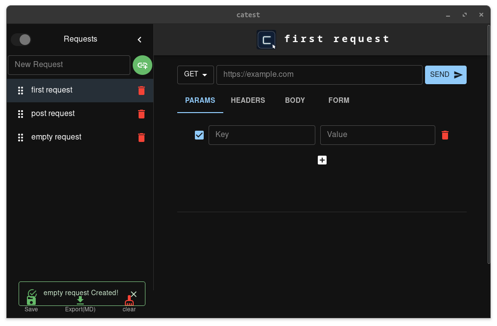
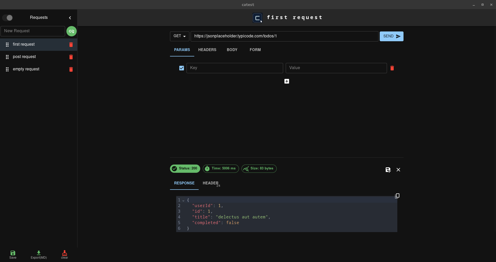
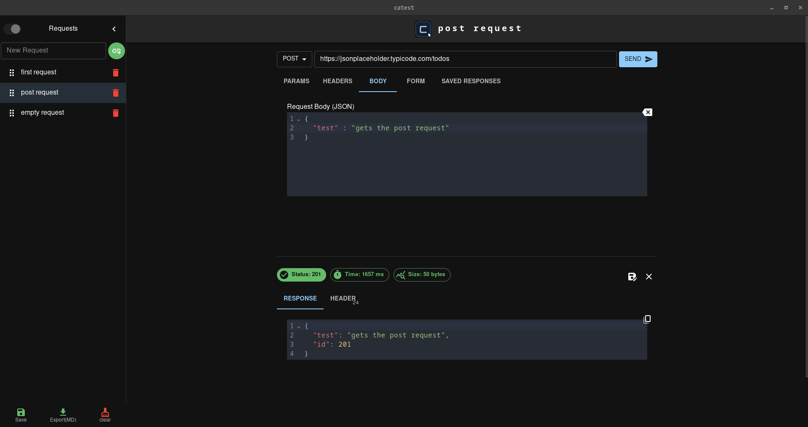
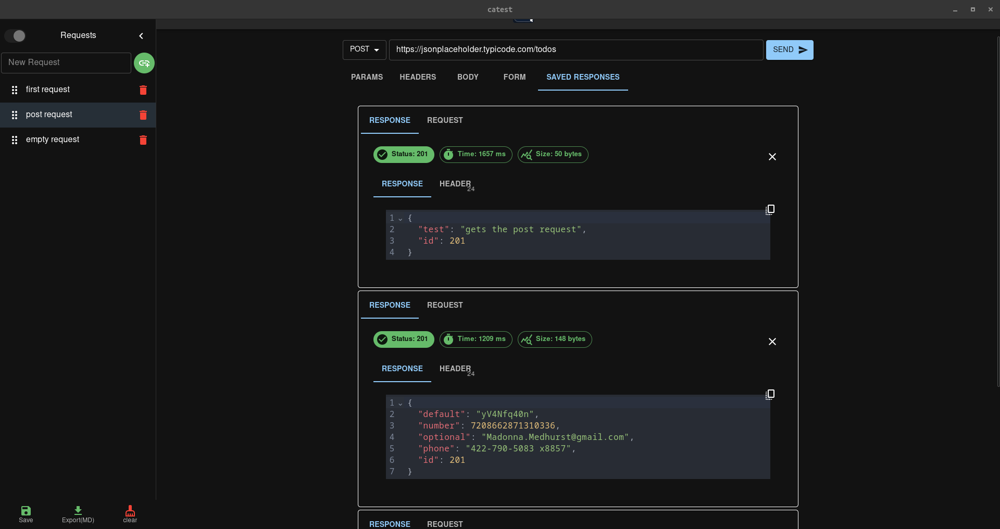
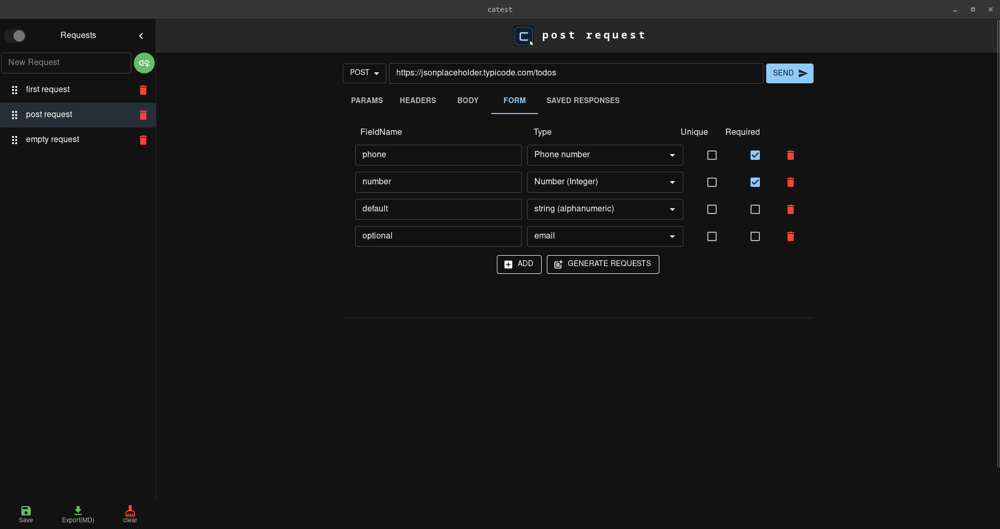
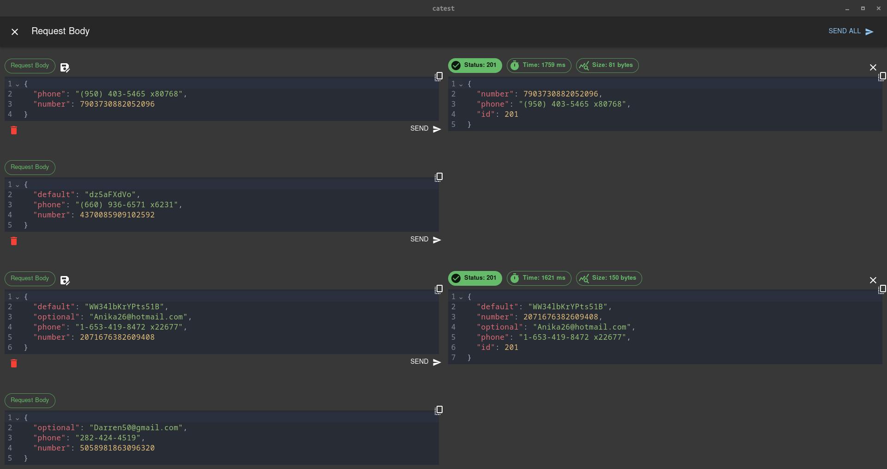
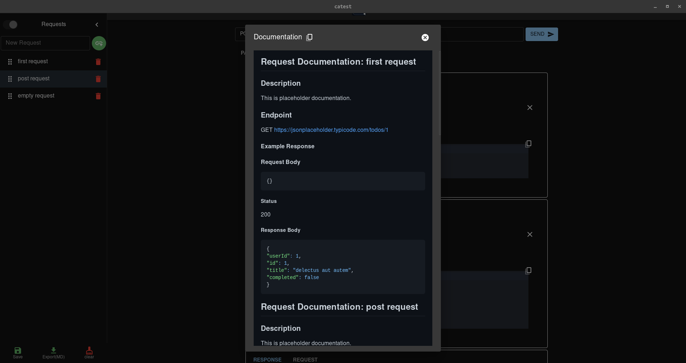
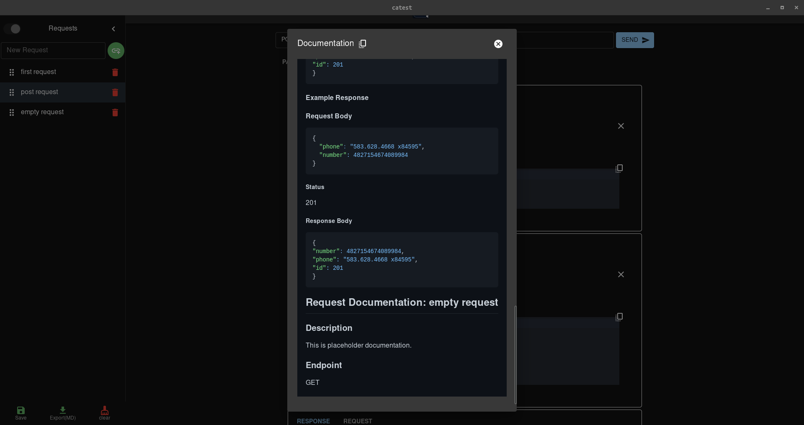

# Catest

Catest aims to be a cross platform, simple and lightweight automated API testing tool/Documentation Generator. Created with Tauri and Reactjs for frontend

#### Why
The inspiration behind creating Catest came from the challenges of maintaining up-to-date tests for [bug2progress](https://github.com/snh1999/bug2progress),To simplify the process, the idea of building a straightforward automated API testing and documentation generator came to light. Specially when the exisiting platforms didn't exactly have that functionality.

Behind the name - The name "Catest" originates from the combination of "CAT" (inspired by lazy and curious creatures) and "TEST".

## Demo






## Features

-   Manual API testing with the ability to include headers, query parameters, and request bodies.
-   Persistence of application state, allowing for seamless continuation of testing sessions.
-   Automated Data generation (Testing with Form fields)
    
    
-   Documentation Generator from fixed template.
    
    

### Features being tested/ being polished

-   Drag-drop (sequence change) for Saved Response (Fixing the animation issue caused by dnd-kit)
-   Introduction of a new Light theme, replacing the default MUI theme.
-   Planned feature: Documentation generation using provided templates (Template validation yet to be implemented).
-   Documentation parser from template

## Installation

### Build from source

To install Catest, you need to have Rust and pnpm available. Then, you can build the project from source:

```bash
pnpm tauri build
```

follow the tauri documentation for building in [windows](https://tauri.app/v1/guides/building/windows), [macOS](https://tauri.app/v1/guides/building/macos) and [Linux](https://tauri.app/v1/guides/building/linux)

### Releases

To download the application, please visit the releases page. All platforms are available: AppImage, `.deb` (linux), `.exe` (Windows) and `.dmg`(MacOS, not tested).

## Dependencies

Catest depends on the following external npm packages:

-   zustand (version 4.3.9) - A simple state management tool used for implementing persistance.
-   MUI ("^11.11") - To adhere to the Material Design system and utilize icons.
-   codemirror (lang-json") - To display well-formatted JSON inputs.
-   react-beautiful-dnd (^13.1.1") - **TO BE CHANGED**, I already have functional replacement code supporting the drag-drop feature to integrate @dnd-kit, but there is some jitter animation(caused by sortable transform) while dragging. I will replace it (along with @formkit/auto-animate- "0.7") as soon as I figure the animation issue out.
-   tauri-plugin-sql(**FUTURE**) - This is more related to Tauri's Rust backend. It will be used for project storage and loading (Note: the current documentation/file parsing method is a bit slow).

## Planned Improvements

-   Undo operation functionality(throughout the app).
-   Separate settings Menu
-   Responsive layout design for better usability across different devices.
-   Multiple Project View
-   Request Folder Nesting for a more organized view and documentation generation.
-   HTTPs, HTML export and styling
-   Example template for different language.

## Contributing

Contributions to Catest are welcome! If you find any issues or have suggestions for improvements, please open an issue or submit a pull request.

## License

Catest is released under the MIT License. See the [LICENSE](LICENSE) file for details.
